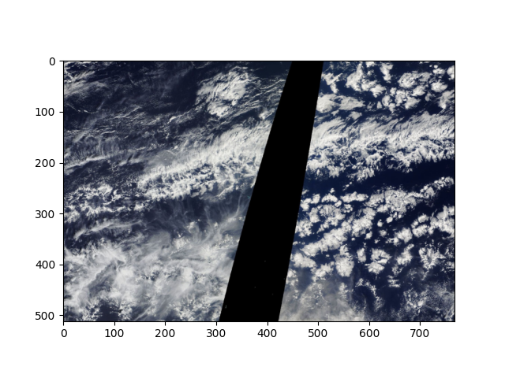
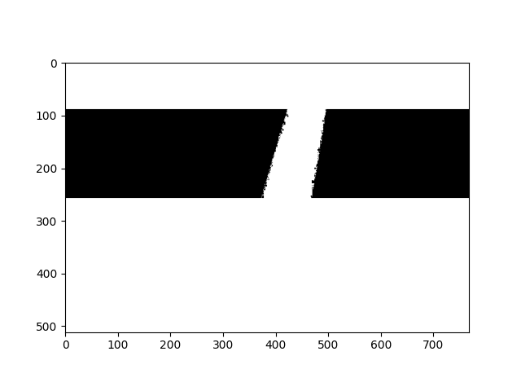
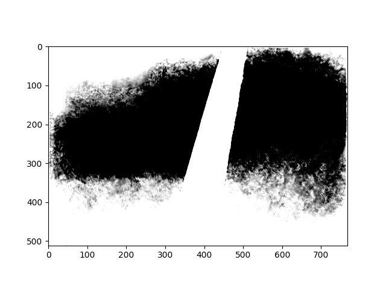

## 📌 Introduction

Since ancient times weather forecasting is an important part of human life and in recent years the technology for its analysis has quickly grown using physiscs-simulations and recently also Machine Learning.

However, the potential usecases of Machine Learning in weather analysis spans a wide range. Since weather is inherintly a spatial problem it's analysis methods are strongly coupled to CNN's.

One of the common problems is the analysis of satellite data for example in order to classify cloud types. I exactly want to try this in a small project to deepen my knowledge in:
- Dataset creation of Image's and mask's
- Image augmentations
- Convolutional neural network structures

This project is my personal playground to experiment with these techniques — especially for creating a full datapipeline and exploring CNN network architectures.

---

## Dataset

We will use the understanding_cloud_organization [Dataset](https://www.kaggle.com/competitions/understanding_cloud_organization/data) from a kaggle competition in 2019. It contains satellite pictures of clouds and hand labeled masks marking four types of clouds (Flower, Gravel, Fish, Sugar). The goal is to predict those masks given an image and we may cacluate the accuracy of these predictions by using the dice coefficient, which basically measures how many pixels are predicted correctly.

## ⚙️ Installation

1. Clone the repository
```bash
git clone git@github.com:SATheinen/cloud-type-recognition.git
cd cloud-type-recognition.git
```

2. Initialise and activate a python venv inside `cloud-type-recognition`
```bash
`python -m venv venv`
`source venv/bin/activate`
`pip install -r requirements.txt`
```

3. Setup Kaggle and download data
First create a kaggle account then setup the kaggle key:
```bash
pip install kaggle
mkdir ~/.kaggle
touch ~/.kaggle/kaggle.json
vim ~/.kaggle/kaggle.json
```
Copy paste your api key from the kaggle website inside the ```kaggle.json```
```vim
esc
:wq
enter
```
Now you can download and unzip the dataset:
```bash
kaggle competitions download -c understanding_cloud_organization
unzip understanding_cloud_organization.zip
```

4. Run the code locally or on a cluster
4.1 Locally
```bash
jupyter-notebook main.ipynb
```
or if you Visual Studio Code
```bash
code main.ipynb
```

4.2 Cluster (Many configurations depend on the cluster and most likely need adjustments)
Connect to cluster and start interactive job
```bash
ssh your_cluster
cd cloud-type-recognition
sbatch job.slurm
```
Then create a tunnel from your local terminal to the port (for example 8889) 
```bash
ssh -L 8889:localhost:8889 -J user_name@login user_name@node_address
```
Finally type ```http://localhost:8889``` in your local browser.
You should now have a local jupyter notebook connected to the compute resources of your cluster.

## Usage
Inside the jupyter notebook you can find all configurations inside the second cell. 
After setting all parameters you may select the jupyter button on the top named ```Kernel```
and then ```Restart Kernel and Run all cells```

**Example Output**

Epoch: 9
Train loss: 0.7080
Val loss: 0.6830
Dice coefficient: 0.3156







## ⭐ Features Summary
🎭 Full image and mask loading pipeline
🔁 Heavy image augmentations
💬 Dynamic loss function
🧱 Debugging options

## File structure overview
```
├── job.slurm
├── main.ipynb
├── README.md
├── requirements.txt
├── sample_submission.csv
├── test_images
├── train_images
├── train_images_broken
├── train_images.txt
└── train.csv
```

## Dependencies & Acknowledgments

This project uses the following open-source tools:

- [Mistral-7B-Instruct](https://github.com/qubvel-org/segmentation_models.pytorch) – MIT License

These tools are not distributed in this repo; users must install/download them separately.

## 👤 Author

**Silas Theinen**
🔗 [GitHub](https://github.com/SATheinen)
📫 Reach me on [LinkedIn](https://www.linkedin.com/in/silas-theinen-058977358)